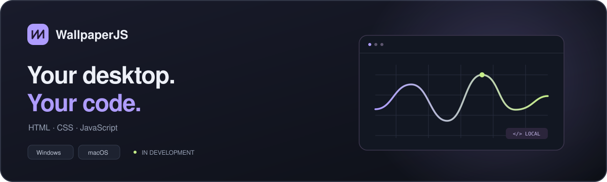

# WallpaperJS

**Your desktop, written in HTML · CSS · JavaScript.**

Turn your own web creations into a living desktop.

[Download](https://github.com/aidevksh/WallpaperJS-Releases/releases/tag/v0.1.0) · [English](README.md) · [한국어](README.ko.md) · [Report an issue](https://github.com/aidevksh/WallpaperJS-Releases/issues)

---

## A desktop made by you

Import a local HTML, CSS, and JavaScript project and bring it to your desktop. Manage your projects and displays in a charcoal and lavender interface.

- **Familiar web tools** — use your own web projects as wallpapers.
- **More screens, one scene** — apply to multiple displays, or span one continuous scene across a Windows display set.
- **Playback that fits your work** — choose 30 or 60 FPS, and pause when needed.
- **At home in the background** — close the window and keep running from the tray or menu bar.
- **English and Korean** — follow the system language or choose your own.

## Download

**v0.1.0 · First preview release** — choose the installer for your operating system and CPU. The library starts empty; no wallpaper catalog is bundled.

| Operating system | CPU | Installer |
| --- | --- | --- |
| Windows | Intel / AMD (x64) | [Download .exe](https://github.com/aidevksh/WallpaperJS-Releases/releases/download/v0.1.0/WallpaperJS-0.1.0-windows-x64.exe) |
| Windows | ARM64 | [Download .exe](https://github.com/aidevksh/WallpaperJS-Releases/releases/download/v0.1.0/WallpaperJS-0.1.0-windows-arm64.exe) |
| macOS 14.2+ | Apple Silicon (M-series) | [Download .dmg](https://github.com/aidevksh/WallpaperJS-Releases/releases/download/v0.1.0/WallpaperJS-0.1.0-macos-arm64.dmg) |
| macOS 14.2+ | Intel (x64) | [Download .dmg](https://github.com/aidevksh/WallpaperJS-Releases/releases/download/v0.1.0/WallpaperJS-0.1.0-macos-x64.dmg) |

[SHA-256 checksums](https://github.com/aidevksh/WallpaperJS-Releases/releases/download/v0.1.0/SHA256SUMS.txt) · [Release notes](https://github.com/aidevksh/WallpaperJS-Releases/releases/tag/v0.1.0)

### Installation

**Windows:** run the `.exe` and choose an installation location. These builds are not code-signed, so Windows may show a SmartScreen warning.

**macOS:** open the `.dmg` and drag WallpaperJS into Applications. These builds do not have Developer ID signing or Apple notarization, so Gatekeeper may block launch. Verify the download source, then review the blocked-app notice in **System Settings → Privacy & Security**. Managed devices may restrict launch.

## Your first wallpaper

1. Prepare a local project containing `wallpaper.json` and your web files.
2. Import its folder or ZIP in the app.
3. Select your displays and apply the wallpaper.
4. On Windows, optionally join the selected displays into one continuous scene.

Closing the window keeps wallpapers running. Reopen the app from the Windows notification area or macOS menu bar; choose **Quit** in that menu to exit completely.

## Platforms and known limitations

| Feature | Windows | macOS |
| --- | --- | --- |
| HTML / CSS / JS wallpapers | Supported | Supported |
| Per-display wallpapers | Supported | Supported |
| One scene spanning several displays | Display sets | Not supported |
| Lock-screen image | Snapshot or separate image | Not supported |
| English / Korean | Supported | Supported |

- Windows lock screens support **still images** only; device policy may restrict changes.
- The FPS setting limits `requestAnimationFrame`, not CSS animations or video. Resuming after a pause reloads the project.
- Native desktop attachment has been exercised on Windows 11 x64 and macOS ARM64. Installer testing on physical devices, macOS Spaces / Mission Control / multiple displays, and Windows mixed-DPI display sets still need validation.
- Linux is not supported.

## License

WallpaperJS is distributed under [Apache License 2.0](LICENSE). See [NOTICE](NOTICE) for attribution and the installed package for dependency license notices. Imported wallpapers retain their authors' licenses.

This repository hosts official downloads and distribution documentation. Application source is maintained separately in a private repository.
